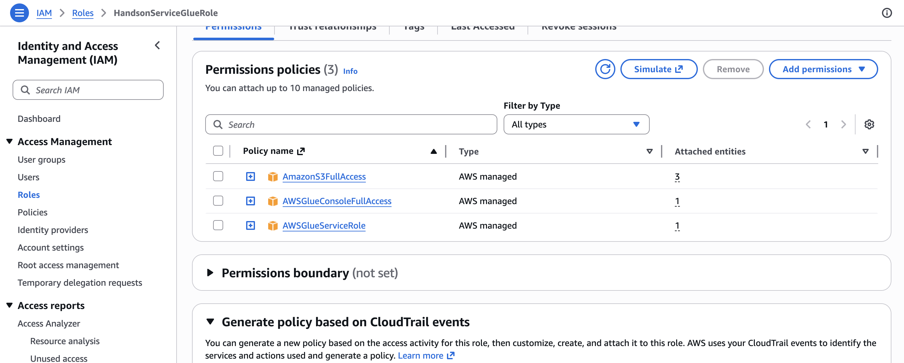
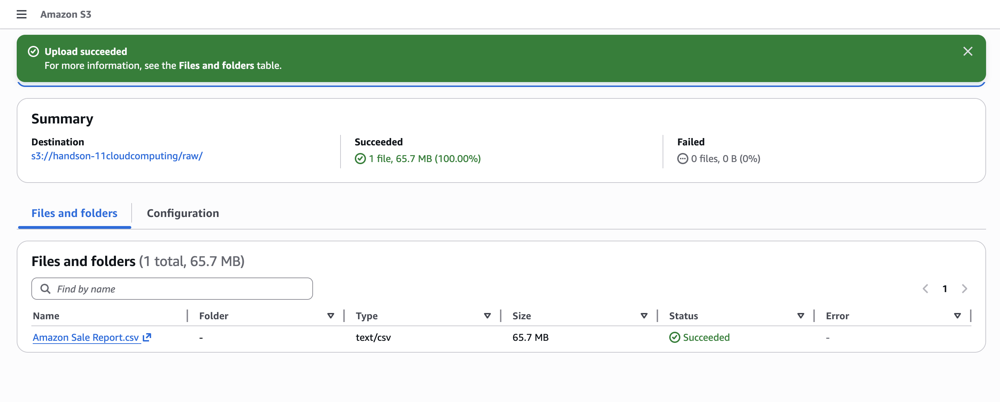
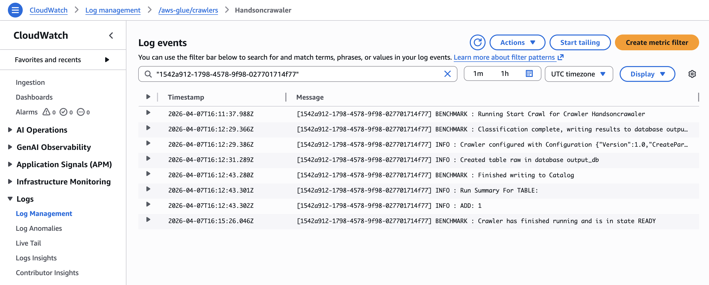

# Project Submission

This repository contains the artifacts for the assignment submission.

## Submission Requirements

- Submit the SQL query script and the CSV results for each query.
- Include the final README with explanations, approach, and screenshots for:
  - CloudWatch
  - IAM role
  - S3 Buckets

## Approach

- I signed in to the AWS Management Console and opened Amazon S3.
- I created a new S3 bucket with a globally unique name and selected the appropriate AWS region.
- I reviewed bucket settings and kept secure defaults for this project.
- I uploaded files to the bucket and verified successful uploads from the S3 object list.
- I configured IAM role permissions required for secure access to AWS resources used in this project.
- I used CloudWatch to monitor resource activity and confirm the setup was functioning as expected.

## SQL Results

CSV outputs currently available:

- `sql_outputs/sql1/query1output.csv`
- `sql_outputs/sql2/query2output.csv`
- `sql_outputs/sql3/query3output.csv`
- `sql_outputs/sql4/query4output.csv`
- `sql_outputs/sql5/query5output.csv`

## AWS Service Explanations

Amazon S3 (Simple Storage Service) is AWS object storage used to store and retrieve files at scale. In this project, S3 is used to create a bucket and upload files, providing durable storage and a central location for data artifacts.

AWS Identity and Access Management (IAM) is the service used to control authentication and authorization across AWS resources. In this project, IAM roles and permissions are used to grant only the required access to S3 and related services, which helps enforce secure, least-privilege access.

Amazon CloudWatch is AWS monitoring and observability service for logs, metrics, and alerts. In this project, CloudWatch is used to track activity and monitor resource behavior so the setup can be validated and issues can be identified quickly.

## AWS Screenshots

### IAM Role

### S3 Buckets

### CloudWatch

